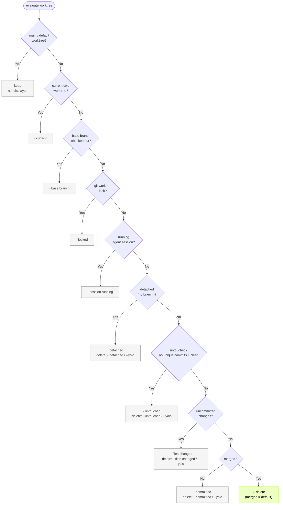

# git-harvest

[English](./README.md) | 日本語

<p>
  <a href="https://www.npmjs.com/package/git-harvest"></a>
</p>

branch と worktree の片付けツール

## お試し

何が消えるか確認:

```sh
npx -y git-harvest@latest --dry-run
```

```
Worktrees
  ·  ~/.claude/worktrees/foo   untouched   base と同一・作業なし
  →  ~/.claude/worktrees/done

Branches
  ·  feature/wip               committed   閾値未満で保護
  →  feature/done
```

## セットアップ (任意)

`npx -y git-harvest@latest` だけでも動きますが、alias を登録すると短く呼べます。常に最新版が走るので、アップデート不要です。

```sh
git config --global alias.harvest '!npx -y git-harvest@latest'
# または: git config --global alias.harvest '!pnpx git-harvest@latest'
# または: git config --global alias.harvest '!bunx git-harvest@latest'
```

## 使い方

```sh
git harvest
# merged な branch を削除 (デフォルト・最も安全。post-merge hook でも安全)

git harvest --dry-run
git harvest -n
# 削除せず、削除対象だけ表示

git harvest --committed
# committed な作業も削除 (未コミットは守る)

git harvest --files-changed
# 未コミットの worktree も削除 (worktree 系のみ)

git harvest --untouched
# untouched な worktree も削除 (作業なし・base と同一)

git harvest --detached
# detached な worktree も削除 (branch 無し)
# ⚠ detached worktree の commit は復旧不可
```

フラグは自由に組み合わせられます。`git harvest --committed --untouched` は committed な branch と untouched な worktree をまとめて削除します。

全部消したいとき:

```sh
git harvest --yolo
# --files-changed --committed --untouched --detached と等価
```

`--committed` と `--files-changed` は scope で対象を絞れます (`=worktree` / `=claude-worktree` / `=branch`)。詳しくは scope セクション参照。

## 自動化 (任意)

`git harvest` を post-merge hook に設定すれば、merge や pull のたびに自動実行されます。

### [lefthook](https://github.com/evilmartians/lefthook) との連携

Lefthook は言語非依存で monorepo 向き。`lefthook-local.yaml` を使えば、他メンバーに影響を与えず自分だけ実行する運用もできます。

```yaml
# lefthook-local.yaml
post-merge:
  commands:
    git-harvest:
      run: npx -y git-harvest@latest
      # or: pnpx git-harvest@latest
      # or: bunx git-harvest@latest
```

## 動作内容

### ステージ (危険 → 安全)

branch はこの順に状態が進む:

```
未着手 (untouched)
  ↓
ファイル変更済  →  commit済  →  merge済
(files-changed)   (committed)  (merged)
  ↑
  └─ 編集すると、どの状態からでも ファイル変更済 へ戻る
```

git-harvest は各 worktree / branch を「最も危険なステージ」で分類します。フラグは閾値を下げ、そのステージと「それより安全な全部」を削除します (✓ = 削除対象):

| stage | 削除リスク | フラグなし | `--committed` | `--files-changed` |
| --- | --- | --- | --- | --- |
| files-changed | 失えば復旧不可 | · | · | ✓ |
| committed | reflog で復旧 (面倒) | · | ✓ | ✓ |
| merged | 完全に安全 | ✓ | ✓ | ✓ |

デフォルトは `merged` のみ削除 — 最も保守的で、post-merge hook でも安全です。

例: `--committed` は committed と merged を削除し、未コミットは守ります。`--files-changed` は未コミット込みで削除します。

### scope (削除対象の絞り込み)

| scope | 対象 |
|---|---|
| `worktree` | 通常パスの worktree (人が作った checkout) |
| `claude-worktree` | `.claude/worktrees/` 配下の worktree |
| `branch` | ブランチ |

閾値は scope ごとに保持されます。`--committed` は全 scope、`--committed=claude-worktree` はその scope だけに効きます。複数指定は comma 区切り (`--committed=worktree,branch`) か、フラグの繰り返しです。

### off-ladder (ステージの外・デフォルト保護)

| 状態 | 定義 | デフォルト | 削除 |
|---|---|---|---|
| `untouched` | clean かつ独自コミット無し (base と同一) | 保護 | `--untouched` / `--yolo` |
| `detached` | branch を持たない worktree (HEAD detached) | 保護 | `--detached` / `--yolo` |

branch の untouched は base と同一の残骸なので、worktree とは非対称にデフォルト削除します (worktree は「使う意図」で守り、branch は残骸として掃除する)。

> ⚠ detached worktree の commit は branch ref が無く、worktree 削除でその reflog も一緒に消えるため恒久的に失われます (reflog でも復旧不可)。`--detached` / `--yolo` のみが対象にします。

### ステータス表示

| マーカー | 意味 |
|---|---|
| `✓` | 削除済み |
| `→` | 削除予定 (dry-run) |
| `·` | 残す (右に理由) |
| `✗` | 削除失敗 |

```
Worktrees
  ·  ~/.claude/worktrees/foo        untouched      base と同一・作業なし
  ·  ~/repo-hotfix                  detached       branch 無し
  ·  ~/.claude/worktrees/bar        committed      閾値 (merged) 未満で保護
  ✓  ~/.claude/worktrees/done

Branches
  ·  feature/wip                    committed      閾値未満で保護
  ✓  feature/done
```

残す理由は state ラベル (files-changed / committed / untouched / detached) か、invariant の理由です。

### invariant (どのフラグ・`--yolo` でも消えない絶対保護)

- メイン / デフォルトの worktree
- base branch を checkout している worktree (`base branch`)
- 現在の作業ディレクトリの worktree (`current`)
- locked な worktree (`git worktree lock`)
- 実行中の agent session を持つ worktree (`session running`)
- 現在 HEAD の branch (`current HEAD`)
- 生存している worktree が checkout 中の branch (`checked out`)

### worktree の判定フロー

フラグなし (デフォルト = 全 scope の閾値 merged) の判定木です。フラグは閾値を下げて keep → delete を切り替えるので、各 keep ノードに「どのフラグなら消えるか」を併記しています。invariant はフラグでは動かせない絶対保護です。



branch 側も同じ考え方で、current HEAD → checked out → 分類の順に判定し、デフォルトでは base に取り込み済み (in-base) のみ削除します。

### Claude Code 連携

git-harvest は実行中の [Claude Code](https://claude.ai/code) セッションを検出し、その worktree を保護します。

| パス | 用途 |
|---|---|
| `~/.claude/sessions/<pid>.json` | 実行中セッションの検出 (`cwd` で worktree を一致確認 + `kill -0 pid` で生存確認) |

`.claude/worktrees/` 配下は `claude-worktree` scope として扱われ、通常の worktree と同じステージ閾値で判定されます (実行中セッションがあれば常に保護)。`--committed=claude-worktree` のように scope 指定で claude worktree だけ閾値を下げられます。

実行中セッションの判定は「ローカルに active な process があるか」(= `~/.claude/sessions/<pid>.json` が一致) だけを信号にします。Remote Control の iPhone 表示 (Connected / Disconnected / Archived) は区別しません。会話履歴 (`~/.claude/projects/<encoded-cwd>/<session-id>.jsonl`) は worktree を消しても残るため、`claude --resume <session-id>` で続きから再開できます。

テストや非標準インストール用にパスを上書きする env var:

| 環境変数 | デフォルト |
|---|---|
| `GIT_HARVEST_CLAUDE_SESSIONS_DIR` | `~/.claude/sessions` |
