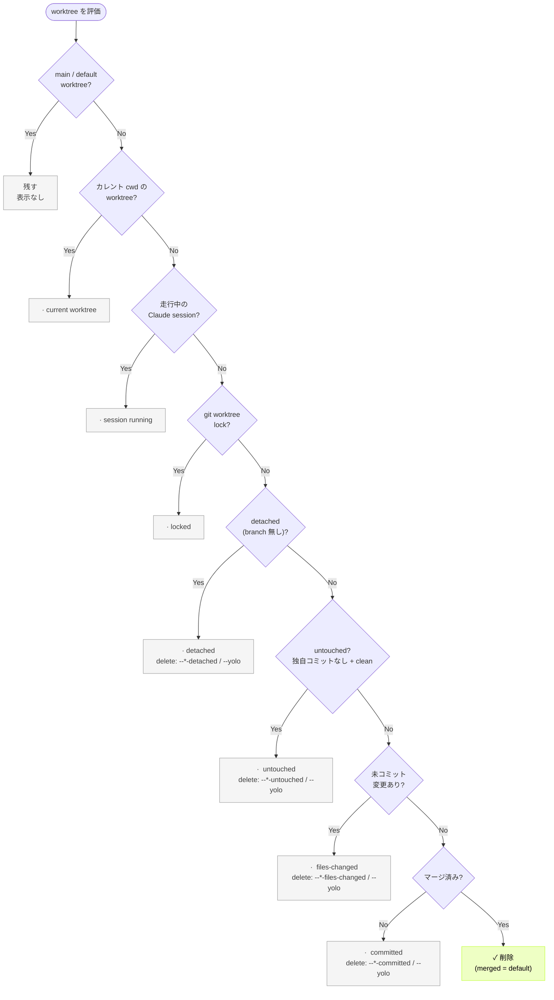
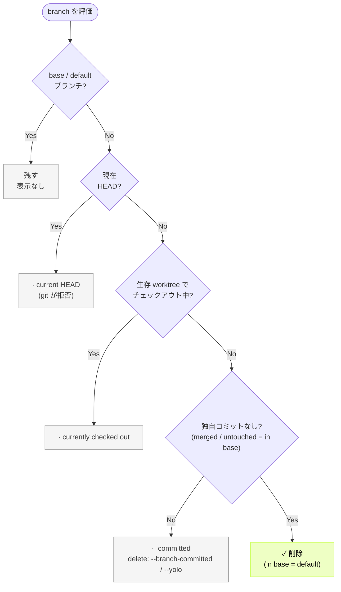

# git-harvest

[English](./README.md) | 日本語

<br>
<div align="center">
  
</div>

<p align="center">
  <a href="https://www.npmjs.com/package/git-harvest"></a>
</p>
<br>

branch と worktree を自動で整理するツール


## お試し (`--dry-run`)

削除対象を表示するだけで、実際には何も削除しません:

```sh
npx -y git-harvest@latest --dry-run
```

## インストールせずに直接実行 (推奨)

Node が必要です。常に最新版が走るので、アップデート作業は不要です。

```sh
# bun
bunx git-harvest@latest

# pnpm
pnpx git-harvest@latest

# npm
npx -y git-harvest@latest
```

### (任意) エイリアスを設定

```sh
# bun
echo "alias ghv='bunx git-harvest@latest'" >> ~/.zshrc
echo "alias 'ghv!'='bunx git-harvest@latest --yolo'" >> ~/.zshrc

# pnpm
echo "alias ghv='pnpx git-harvest@latest'" >> ~/.zshrc
echo "alias 'ghv!'='pnpx git-harvest@latest --yolo'" >> ~/.zshrc

# npm
echo "alias ghv='npx -y git-harvest@latest'" >> ~/.zshrc
echo "alias 'ghv!'='npx -y git-harvest@latest --yolo'" >> ~/.zshrc
```

`git harvest`
```sh
# git サブコマンド — `git harvest` として実行 (インストール不要)
git config --global alias.harvest '!pnpm dlx git-harvest@latest'
# または: git config --global alias.harvest '!bunx git-harvest@latest'
# または: git config --global alias.harvest '!npx -y git-harvest@latest'
```

## おすすめの運用法

Git hooksのpost-mergeコマンドと合わせることで、Mergeやpullした際に自動で収穫もできます。

### [lefthook](https://github.com/evilmartians/lefthook)との連携

Git Hooks にはhusky、pre-commit、simple-git-hooks など様々なツールがありますが、Lefthook が言語に依存せず monorepo にも組み込みやすいのでおすすめです。さらに lefthook-local.yaml を使えば、チーム開発で他のメンバーに影響を与えず自分だけ実行する運用も可能です。


```yaml
# lefthook-local.yaml
post-merge:
  commands:
    git-harvest:
      run: npx -y git-harvest@latest
      # or: bunx git-harvest@latest
      # or: pnpx git-harvest@latest
```


## 使い方

```sh
git-harvest
```

引数なしの `git-harvest` は安全な default で、merge済 の worktree / branch だけを削除します。より危険な段階を消すには明示フラグが要ります。

### オプション

```sh
git-harvest --help     # ヘルプを表示
git-harvest --version  # バージョンを表示
git-harvest --dry-run  # 実際には削除せず削除対象を表示 (別名: -n)
git-harvest logo       # git-harvest のロゴを表示
```

各 scope（通常 worktree・`.claude/worktrees/` worktree・branch）は削除の閾値を持ちます。フラグは閾値を危険側の段階へ下げ、そこから merge済 までを全部消します。1 フラグ = 1 scope で、複数指定や `--yolo` 併用では最も危険側が勝ちます。

通常 path の worktree 閾値:

```sh
git-harvest --worktree-files-changed   # ファイル変更済 以降を削除（未コミット込みで全部）
git-harvest --worktree-committed       # commit済 以降を削除（commit済 / merge済）
```

`.claude/worktrees/` path の worktree 閾値:

```sh
git-harvest --claude-worktree-files-changed   # ファイル変更済 以降を削除（全部）
git-harvest --claude-worktree-committed       # commit済 以降を削除
```

branch 閾値（branch に ファイル変更済 は無い）:

```sh
git-harvest --branch-committed   # commit済 以降を削除（全部）
```

ladder 外の worktree（default では保護）:

```sh
git-harvest --worktree-detached          # detached な通常 path worktree を削除
git-harvest --claude-worktree-detached   # detached な .claude/worktrees/ worktree を削除
git-harvest --worktree-untouched         # untouched な通常 path worktree を削除
git-harvest --claude-worktree-untouched  # untouched な .claude/worktrees/ worktree を削除
```

detached worktree の独自コミットは branch から到達できないため、削除すると per-worktree reflog ごと消え恒久喪失しえます。この注意は `--help` の `--worktree-detached` / `--claude-worktree-detached` / `--yolo` に出ます。

nuke — まず `git-harvest --dry-run` で確認してから:

```sh
git-harvest --yolo   # invariant 以外を全部削除（未コミット込み）
```

`--yolo` は通常 path も `.claude/worktrees/` path も、未コミット変更も detached コミットも含めて worktree / branch を全部消し、下記 invariant だけを残します。確認プロンプトは一切なく消します。安全弁は名前だけです。

`--all` は廃止しました。代わりに `--yolo` を使ってください。挙動が変わった点に注意。旧 `--all` は `-f -f` で `git worktree lock` を貫通削除しましたが、`--yolo` は locked worktree を残します（消すなら先に `git worktree unlock`）。

### invariant

フラグや `--yolo` でも動かせない絶対保護:

- main / default-branch の worktree
- カレント cwd の worktree
- locked worktree（`git worktree lock`）
- 走行中 Claude session のある worktree
- 現在 HEAD の branch
- 生存 worktree に checkout 中の branch


## 動作内容

worktree / branch は commit ライフサイクルの段階を進みます。

```
未着手 (untouched)
  ↓
ファイル変更済  →  commit済  →  merge済
(files-changed)   (committed)  (merged)
  ↑
  └─ 編集すると ファイル変更済 へ戻る（どの段階からでも）
```

各リソースは最もリスクの高い（手前の）段階で分類します。未コミットの変更は branch の commit 状態より優先します。merge済 が default で、復旧可能なので安全です。未着手（独自コミットなし・base と同一）と detached（branch を持たない worktree）は ladder の外で、default では保護し専用フラグか `--yolo` でのみ削除します。

### 削除閾値

フラグは scope の閾値を危険側の段階へ下げ、その段階以降（より安全な側）を全部消します（`·` 残す・`✓` 削除）:

| 段階 | 失うと | (default) | `--*-committed` | `--*-files-changed` |
|---|---|---|---|---|
| files-changed | 復旧不可 | · | · | ✓ |
| committed | reflog 復旧（面倒） | · | ✓ | ✓ |
| merged | 完全に復旧可 | ✓ | ✓ | ✓ |

`--*` は通常 path worktree が `--worktree-*`、`.claude/worktrees/` 配下が `--claude-worktree-*`。

### preset 内訳

default は `merged` のみ削除。`--yolo` は下の全フラグを束ねたものです。

| Scope | 段階 | フラグ | default | `--yolo` |
|---|---|---|---|---|
| 通常 worktree | files-changed | `--worktree-files-changed` | · | ✓ |
| 通常 worktree | committed | `--worktree-committed` | · | ✓ |
| 通常 worktree | merged | *(default)* | ✓ | ✓ |
| 通常 worktree | detached | `--worktree-detached` | · | ✓ |
| 通常 worktree | untouched | `--worktree-untouched` | · | ✓ |
| claude worktree | files-changed | `--claude-worktree-files-changed` | · | ✓ |
| claude worktree | committed | `--claude-worktree-committed` | · | ✓ |
| claude worktree | merged | *(default)* | ✓ | ✓ |
| claude worktree | detached | `--claude-worktree-detached` | · | ✓ |
| claude worktree | untouched | `--claude-worktree-untouched` | · | ✓ |
| branch | committed | `--branch-committed` | · | ✓ |
| branch | merged | *(default)* | ✓ | ✓ |

ステータスマーカー:

| マーカー | 意味 |
|---|---|
| `✓` | 削除済み |
| `→` | 削除予定（dry-run） |
| `·` | 残す（理由が続く） |

各残すノードに「どのフラグで消えるか」を併記します。invariant はどのフラグでも動かせません。

### Worktree の判定フロー



`--*` は通常 path worktree なら `--worktree-*`、`.claude/worktrees/` 配下なら `--claude-worktree-*` です。default の挙動は両 path とも同じ（merge済 のみ削除）で、効くフラグだけが違います。

| 判定順 | 状態 | 表示 | 削除されるフラグ |
|---|---|---|---|
| 1 | main / default-branch の worktree | *(表示なし)* | invariant（消えない） |
| 2 | カレント cwd の worktree | `·  current worktree` | invariant（消えない） |
| 3 | 走行中 Claude session (`~/.claude/sessions/<pid>.json` で `cwd` 一致 + pid alive) | `·  session running` | invariant（消えない） |
| 4 | locked（`git worktree lock`） | `·  locked` | invariant（消えない） |
| 5 | detached（branch 無し） | `·  detached` | `--*-detached` / `--yolo` |
| 6 | untouched（独自コミットなし + clean） | `·  untouched` | `--*-untouched` / `--yolo` |
| 7 | files-changed（未コミット変更あり） | `·  files-changed` | `--*-files-changed` / `--yolo` |
| 8 | committed（独自コミットあり・未マージ） | `·  committed` | `--*-committed` / `--*-files-changed` / `--yolo` |
| 9 | merge済み | `✓` / `→` | default |

detached worktree の独自コミットは branch から到達できないため、削除すると per-worktree reflog が消えコミットを恒久喪失しうります。committed worktree は branch ref が残るので `git checkout <branch>` で復活可能で、files-changed worktree を消した時に本当に失われるのは未コミット変更だけです。

#### iPhone の "Disconnected" 表示について

Remote Control session で iPhone / claude app に表示される **"Disconnected"** は、いったん終了して resume できない pause 状態ではなく、**session が完全に終わった状態** です ([公式 docs](https://code.claude.com/docs/en/remote-control#limitations) 参照):

> **Local process must keep running**: Remote Control runs as a local process. If you close the terminal, quit VS Code, or otherwise stop the `claude` process, the session ends.
>
> **Extended network outage**: if your machine is awake but unable to reach the network for more than roughly 10 minutes, the session times out and the process exits.

つまり Disconnected の session は **local process が exit 済み = session 終了済み**。iPhone の一覧に残っているのは server-side の bookkeeping のみで、メッセージを送っても届きません。

git-harvest はこの実態に合わせて **active な local process があるか (= `~/.claude/sessions/<pid>.json` 一致)** だけを判定信号にしており、iPhone 表示の Connected / Disconnected / Archived を区別しません。Disconnected の worktree は live な process が無いため session invariant が外れ、他の worktree と同じく段階で判定されます。

会話履歴 (`~/.claude/projects/<encoded-cwd>/<session-id>.jsonl`) は別途残るため、`claude --resume <session-id>` で続きから新しい session を起動できます (worktree dir は別途 `git worktree add` か `EnterWorktree` で再作成)。

### Branch の判定フロー

branch には working tree が無いので files-changed / detached はありません。untouched（独自コミットなし）は base と同一の ref なので merge済 に畳んで default 削除します。よって branch は committed か merge済（in base、untouched 含む）の 2 状態です。



| 判定順 | 状態 | 表示 | 削除されるフラグ |
|---|---|---|---|
| 1 | base / default ブランチ | *(表示なし)* | invariant（消えない） |
| 2 | 現在 HEAD | `·  current HEAD` | invariant（消えない） |
| 3 | 生存 worktree に checkout 中 | `·  currently checked out` | worktree が消えるまで invariant |
| 4 | committed（独自コミットあり・base に無い） | `·  committed` | `--branch-committed` / `--yolo` |
| 5 | merge済 / untouched（in base） | `✓` / `→` | default |

生存 worktree 集合は worktree cleanup 後に残った worktree です。同じ実行で worktree が消えた branch は裸になり、ここで判定されます。よって untouched branch を checkout 中の worktree を消せば（`--worktree-untouched` / `--yolo`）、その branch も default で消えます。

### Claude Code 連携の詳細

git-harvest は [Claude Code](https://claude.ai/code) の以下のパスを参照します:

| パス | 用途 |
|---|---|
| `~/.claude/sessions/<pid>.json` | 走行中 Claude session の検出（`cwd` で worktreePath を一致確認 + `kill -0 pid` で生存確認） |

Claude Code Agent View や claude app の remote control から session を archive / delete すると、対応する `~/.claude/sessions/<pid>.json` が削除されます。走行中 session のある worktree は invariant で必ず保護されますが、session ファイルが無くなれば他と同じく段階で判定されます。

`.claude/worktrees/` 配下の worktree は別 scope として扱います。default は同じく merge済 のみ削除で、閾値を下げるのが `--worktree-*` ではなく `--claude-worktree-*` になる点だけが違います。`--yolo` は worktree dir だけを消し、session のメタデータには触りません。会話履歴 (`~/.claude/projects/<encoded-cwd>/<session-id>.jsonl`) は別途残るので、`claude --resume <session-id>` で続きから新しい session を起動できます (worktree dir は `git worktree add` か `EnterWorktree` で再作成)。

テストや非標準インストール用にパスを上書きする env var:

| 環境変数 | デフォルト |
|---|---|
| `GIT_HARVEST_CLAUDE_SESSIONS_DIR` | `~/.claude/sessions` |


