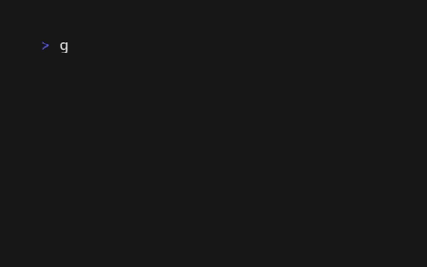

# git-harvest

[English](./README.md) | 日本語

<br>
<div align="center">
  
</div>
<br>

branch と worktree を自動で整理するツール


## インストールせずに直接実行

```sh
# bun
bunx git-harvest@latest

# pnpm
pnpx git-harvest@latest

# npm
npx -y git-harvest@latest
```

### (任意) エイリアスを設定

```sh
# bun
echo "alias ghv='bunx git-harvest@latest'" >> ~/.zshrc
echo "alias 'ghv!'='bunx git-harvest@latest --all'" >> ~/.zshrc

# pnpm
echo "alias ghv='pnpx git-harvest@latest'" >> ~/.zshrc
echo "alias 'ghv!'='pnpx git-harvest@latest --all'" >> ~/.zshrc

# npm
echo "alias ghv='npx -y git-harvest@latest'" >> ~/.zshrc
echo "alias 'ghv!'='npx -y git-harvest@latest --all'" >> ~/.zshrc
```

## インストール

### Shell (macOS/Linux) (recommended)

```sh
curl -fsSL https://raw.githubusercontent.com/nozomiishii/git-harvest/main/install.sh | bash
```

ターミナルを再起動するか `source ~/.zshrc` を実行すると git-harvest が使えるようになります。

### Homebrew

```sh
brew install nozomiishii/tap/git-harvest
```

### (任意) エイリアスを設定

エイリアスを設定するとより手軽に実行できます。両方設定しても片方だけでも設定できます:

`ghv` / `ghv!`
```sh
# シェルエイリアス
echo "alias ghv='git-harvest'" >> ~/.zshrc
echo "alias 'ghv!'='git-harvest --all'" >> ~/.zshrc
```

`git harvest`
```sh
# Git サブコマンド — `git harvest` で実行可能
git config --global alias.harvest '!git-harvest'
```


## アンインストール

```sh
curl -fsSL https://raw.githubusercontent.com/nozomiishii/git-harvest/main/uninstall.sh | bash
```


## 使い方

```sh
git-harvest
```

### オプション

```sh
git-harvest --help     # ヘルプを表示
git-harvest --version  # バージョンを表示
git-harvest --dry-run  # 実際には削除せず、削除対象を表示
git-harvest --all      # デフォルトブランチ以外の全ブランチ・worktree を削除
git-harvest logo       # git-harvest のロゴを表示
```

## おすすめの運用法

Git hooksのpost-mergeコマンドと合わせることで、Mergeやpullした際に自動で収穫もできます。

### [lefthook](https://github.com/evilmartians/lefthook)との連携

Git Hooks にはhusky、pre-commit、simple-git-hooks など様々なツールがありますが、Lefthook が言語に依存せず monorepo にも組み込みやすいのでおすすめです。さらに lefthook-local.yaml を使えば、チーム開発で他のメンバーに影響を与えず自分だけ実行する運用も可能です。


```yaml
# lefthook-local.yaml
post-merge:
  commands:
    git-harvest:
      run: npx -y git-harvest@latest
      # or: bunx git-harvest@latest
      # or: pnpx git-harvest@latest
```


## 動作内容

### Worktree

| 状態 | 表示 | 通常 | `--all` |
|---|---|---|---|
| マージ済み + 変更なし | `[DELETED]` / `[WILL DELETE]` | 削除 | 削除 |
| マージ済み + 未コミット変更あり | `[GROWING] (uncommitted changes)` | 残す | 削除 |
| 未マージ | `[GROWING] (not merged)` | 残す | 削除 |
| 独自コミットなし | `[GROWING] (no unique commits)` | 残す | 削除 |
| メインワーキングツリー | *(表示なし)* | 残す | 残す |

### ブランチ

| 状態 | 表示 | 通常 | `--all` |
|---|---|---|---|
| マージ済み | `[DELETED]` / `[WILL DELETE]` | 削除 | 削除 |
| マージ済み + チェックアウト中 | `[GROWING] (currently checked out)` | 残す | エラー |
| 未マージ | `[GROWING] (not merged)` | 残す | 削除 |
| 独自コミットなし | `[DELETED]` / `[WILL DELETE]` | 削除 | 削除 |
| デフォルトブランチ | *(表示なし)* | 残す | 残す |

> デフォルトブランチ以外をチェックアウト中に `--all` を実行すると、何も削除せずエラー終了します。`--dry-run --all` では全リソースを `[WILL DELETE]` で表示します（エラーにならない）。


