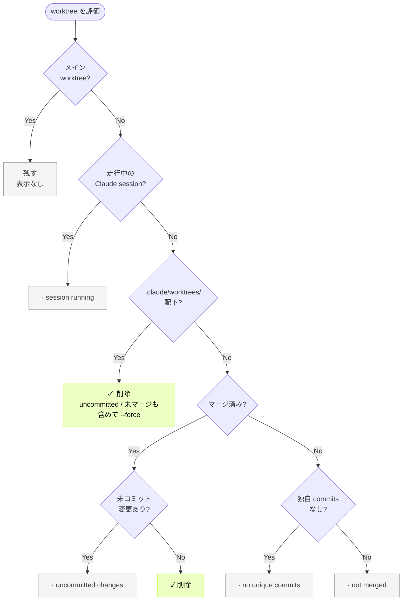
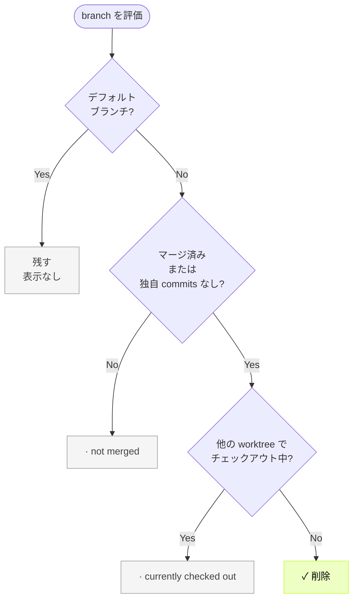

# git-harvest

[English](./README.md) | 日本語

<br>
<div align="center">
  
</div>
<br>

branch と worktree を自動で整理するツール


## インストールせずに直接実行

```sh
# bun
bunx git-harvest@latest

# pnpm
pnpx git-harvest@latest

# npm
npx -y git-harvest@latest
```

### (任意) エイリアスを設定

```sh
# bun
echo "alias ghv='bunx git-harvest@latest'" >> ~/.zshrc
echo "alias 'ghv!'='bunx git-harvest@latest --all'" >> ~/.zshrc

# pnpm
echo "alias ghv='pnpx git-harvest@latest'" >> ~/.zshrc
echo "alias 'ghv!'='pnpx git-harvest@latest --all'" >> ~/.zshrc

# npm
echo "alias ghv='npx -y git-harvest@latest'" >> ~/.zshrc
echo "alias 'ghv!'='npx -y git-harvest@latest --all'" >> ~/.zshrc
```

## インストール

### Shell (macOS/Linux)

```sh
curl -fsSL https://raw.githubusercontent.com/nozomiishii/git-harvest/main/install.sh | bash
```

ターミナルを再起動するか `source ~/.zshrc` を実行すると git-harvest が使えるようになります。

### Homebrew

```sh
brew install nozomiishii/tap/git-harvest
```

### (任意) エイリアスを設定

エイリアスを設定するとより手軽に実行できます。両方設定しても片方だけでも設定できます:

`ghv` / `ghv!`
```sh
# シェルエイリアス
echo "alias ghv='git-harvest'" >> ~/.zshrc
echo "alias 'ghv!'='git-harvest --all'" >> ~/.zshrc
```

`git harvest`
```sh
# Git サブコマンド — `git harvest` で実行可能
git config --global alias.harvest '!git-harvest'
```


## アンインストール

```sh
curl -fsSL https://raw.githubusercontent.com/nozomiishii/git-harvest/main/uninstall.sh | bash
```


## 使い方

```sh
git-harvest
```

### オプション

```sh
git-harvest --help     # ヘルプを表示
git-harvest --version  # バージョンを表示
git-harvest --dry-run  # 実際には削除せず、削除対象を表示
git-harvest --all      # デフォルトブランチ以外の全ブランチ・worktree を削除
git-harvest logo       # git-harvest のロゴを表示
```

## おすすめの運用法

Git hooksのpost-mergeコマンドと合わせることで、Mergeやpullした際に自動で収穫もできます。

### [lefthook](https://github.com/evilmartians/lefthook)との連携

Git Hooks にはhusky、pre-commit、simple-git-hooks など様々なツールがありますが、Lefthook が言語に依存せず monorepo にも組み込みやすいのでおすすめです。さらに lefthook-local.yaml を使えば、チーム開発で他のメンバーに影響を与えず自分だけ実行する運用も可能です。


```yaml
# lefthook-local.yaml
post-merge:
  commands:
    git-harvest:
      run: npx -y git-harvest@latest
      # or: bunx git-harvest@latest
      # or: pnpx git-harvest@latest
```


## 動作内容

ステータスマーカー:

| マーカー | 意味 |
|---|---|
| `✓` | 削除済み |
| `→` | 削除予定（dry-run） |
| `·` | 残す（理由が続く） |

### Worktree の判定フロー



| 判定順 | 条件 | 表示 | 通常 | `--all` |
|---|---|---|---|---|
| 1 | 走行中の Claude session (`~/.claude/sessions/<pid>.json` で `cwd` 一致 + pid alive) | `·  session running` | 残す | 削除 |
| 2 | path が `.claude/worktrees/` 配下 + 走行中 session 無し | `✓` / `→` | **削除** (uncommitted / 未マージ commits 含む) | 削除 |
| 3 | マージ済み + 未コミット変更あり | `·  uncommitted changes` | 残す | 削除 |
| 4 | マージ済み + 変更なし | `✓` / `→` | 削除 | 削除 |
| 5 | 独自コミットなし | `·  no unique commits` | 残す | 削除 |
| 6 | 未マージ | `·  not merged` | 残す | 削除 |
| - | メインワーキングツリー | *(表示なし)* | 残す | 残す |

判定 2 は **path-regime**（パスベース判定）です。`.claude/worktrees/` 配下の worktree は Claude Code が管理する workspace と見なし、active session が無い = archive された or 閉じられた = 不要、として積極的に削除します。Claude が管理しないパス（手動の `git worktree add` で別の場所に作った等）は判定 3 以降の従来ロジックで保守的に扱います。

**`.claude/worktrees/` 配下の削除挙動**: uncommitted changes や未マージ commits があっても `--force` で削除されます。ただし以下は失われません:

- **会話履歴**: Claude Code 側に残るので `claude --resume <session-id>` で再開可能
- **未マージ commits**: branch ref として残るので `git checkout <branch>` で復活可能（cleanup_branches は未マージ branch を保護する）

完全に失われるのは **uncommitted changes** だけなので、Claude session を閉じる前に commit を済ませることを推奨します。逆に言うと、uncommitted で守りたいものがあれば Claude session を開いたままにしておけば保護されます。

### Branch の判定フロー



| 状態 | 表示 | 通常 | `--all` |
|---|---|---|---|
| マージ済み | `✓` / `→` | 削除 | 削除 |
| マージ済み + チェックアウト中 | `·  currently checked out` | 残す | エラー |
| 未マージ | `·  not merged` | 残す | 削除 |
| 独自コミットなし | `✓` / `→` | 削除 | 削除 |
| デフォルトブランチ | *(表示なし)* | 残す | 残す |

> デフォルトブランチ以外をチェックアウト中に `--all` を実行すると、何も削除せずエラー終了します。`--dry-run --all` では全リソースを `→` で表示します（エラーにならない）。

### Claude Code 連携の詳細

git-harvest は [Claude Code](https://claude.ai/code) の以下のパスを参照します:

| パス | 用途 |
|---|---|
| `~/.claude/sessions/<pid>.json` | 走行中 Claude session の検出（`cwd` で worktreePath を一致確認 + `kill -0 pid` で生存確認） |

Claude Code Agent View や claude app の remote control から session を archive / delete すると、対応する `~/.claude/sessions/<pid>.json` が削除されます。git-harvest はその「session ファイルが無くなった」状態を「user がもう要らない意思を示した」として扱います。

**`--all`** は全ガードを無視して強制削除します。worktree dir だけが消え、セッションのメタデータには触りません。

**Claude Code が未インストール**の場合は該当パスが無いため `.claude/worktrees/` 配下の worktree も path-regime で削除されます。手動で `.claude/worktrees/X` を作る運用をしているなら、Claude を入れていなくても削除される点に注意してください (使ってない方は通常そういう path 規約は採用しないので影響は限定的)。

テストや非標準インストール用にパスを上書きする env var:

| 環境変数 | デフォルト |
|---|---|
| `GIT_HARVEST_CLAUDE_SESSIONS_DIR` | `~/.claude/sessions` |


