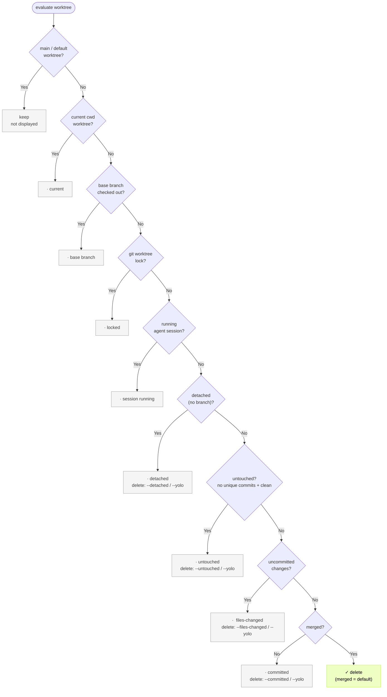

# git-harvest

English | [日本語](./README.ja.md)

<p>
  <a href="https://www.npmjs.com/package/git-harvest"></a>
</p>

Branch and worktree cleanup tool.

## Try it

Preview the cleanup:

```sh
npx -y git-harvest@latest --dry-run
```

```
Worktrees
  ·  ~/.claude/worktrees/foo   untouched   identical to base, no work
  →  ~/.claude/worktrees/done

Branches
  ·  feature/wip               committed   below the threshold, kept
  →  feature/done
```

## Setup

Register `git harvest` as a Git alias. It always runs the latest version — nothing to update.

```sh
git config --global alias.harvest '!npx -y git-harvest@latest'
# or: git config --global alias.harvest '!pnpx git-harvest@latest'
# or: git config --global alias.harvest '!bunx git-harvest@latest'
```

## Usage

```sh
git harvest
# Removes merged branches (the safe default -- works in a post-merge hook too)

git harvest --dry-run
git harvest -n
# Shows what would be deleted without deleting

git harvest --committed
# Removes committed work too (still keeps uncommitted)

git harvest --files-changed
# Removes uncommitted worktrees too (worktree scopes only)

git harvest --untouched
# Also removes untouched worktrees (no work, identical to base)

git harvest --detached
# Also removes detached worktrees (no branch)
# WARNING: commits in a detached worktree are unrecoverable
```

Flags combine freely. `git harvest --committed --untouched` removes committed branches plus untouched worktrees.

Or skip the nuance:

```sh
git harvest --yolo
# Equivalent to --files-changed --committed --untouched --detached
```

Both `--committed` and `--files-changed` accept an optional scope (`=worktree`, `=claude-worktree`, `=branch`). See [Scopes](#scopes-narrowing-the-target) for details.

## Automate (optional)

Add `git harvest` to a post-merge hook and it runs on every merge or pull.

### With [lefthook](https://github.com/evilmartians/lefthook)

Lefthook is language-agnostic and easy to drop into a monorepo. With `lefthook-local.yaml` you can run it only for yourself without affecting teammates.

```yaml
# lefthook-local.yaml
post-merge:
  commands:
    git-harvest:
      run: npx -y git-harvest@latest
      # or: pnpx git-harvest@latest
      # or: bunx git-harvest@latest
```

## How it works

### Stages (risky → safe)

A branch goes through these states:

```
untouched
  ↓
files-changed  →  committed  →  merged
  ↑
  └─ editing brings it back to files-changed (from any state)
```

git-harvest classifies each worktree / branch by its riskiest stage. A flag lowers the threshold and deletes that stage and everything safer (✓ = deleted):

| stage | risk when deleted | no flag | `--committed` | `--files-changed` |
| --- | --- | --- | --- | --- |
| files-changed | unrecoverable | · | · | ✓ |
| committed | reflog recovery (tedious) | · | ✓ | ✓ |
| merged | fully safe | ✓ | ✓ | ✓ |

The default deletes `merged` only — the most conservative choice, safe even in a post-merge hook.

For example, `--committed` deletes committed and merged while keeping uncommitted work; `--files-changed` deletes uncommitted work too.

### Scopes (narrowing the target)

| scope | target |
|---|---|
| `worktree` | worktrees on a normal path (human-made checkouts) |
| `claude-worktree` | worktrees under `.claude/worktrees/` |
| `branch` | branches |

Thresholds are kept per scope. `--committed` affects every scope; `--committed=claude-worktree` affects only that scope. Combine with commas (`--committed=worktree,branch`) or by repeating the flag.

### Off-ladder (outside the stages, protected by default)

| state | definition | default | delete |
|---|---|---|---|
| `untouched` | clean and no unique commits (identical to base) | kept | `--untouched` / `--yolo` |
| `detached` | a worktree with no branch (detached HEAD) | kept | `--detached` / `--yolo` |

An untouched branch is just a ref identical to base, so it is deleted by default — asymmetric with worktrees on purpose (a worktree signals intent; a branch is just leftover).

> WARNING: a detached worktree's commits have no branch ref, and removing the worktree deletes its reflog with it — they can be lost permanently (no reflog recovery). Only `--detached` / `--yolo` target them.

### Status markers

| marker | meaning |
|---|---|
| `✓` | deleted |
| `→` | would delete (dry-run) |
| `·` | kept (reason on the right) |
| `✗` | failed to delete |

```
Worktrees
  ·  ~/.claude/worktrees/foo        untouched      identical to base, no work
  ·  ~/repo-hotfix                  detached       no branch
  ·  ~/.claude/worktrees/bar        committed      below the threshold (merged), kept
  ✓  ~/.claude/worktrees/done

Branches
  ·  feature/wip                    committed      below the threshold, kept
  ✓  feature/done
```

The keep reason is a state label (files-changed / committed / untouched / detached) or an invariant reason.

### Invariants (always protected — no flag or `--yolo` overrides them)

- the main / default worktree
- the worktree on the base branch (`base branch`)
- the worktree of the current working directory (`current`)
- a locked worktree (`git worktree lock`)
- a worktree with a running agent session (`session running`)
- the current HEAD branch (`current HEAD`)
- a branch checked out in a surviving worktree (`checked out`)

### Worktree decision flow

Decision tree at the default threshold (merged). Each keep node shows which flag would override it; invariants cannot be overridden.



Branches follow the same idea — current HEAD → checked out → classification — and by default only branches already in base (in-base) are deleted.

### Claude Code integration

git-harvest detects running [Claude Code](https://claude.ai/code) sessions and protects their worktrees.

| path | purpose |
|---|---|
| `~/.claude/sessions/<pid>.json` | detect a running session (match the worktree by `cwd` + confirm the process with `kill -0 pid`) |

Worktrees under `.claude/worktrees/` belong to the `claude-worktree` scope and follow the same stage thresholds as normal worktrees (always protected while a session is running). Use a scope, e.g. `--committed=claude-worktree`, to lower the threshold for claude worktrees only.

A session counts as running when a matching local process is alive (`~/.claude/sessions/<pid>.json` exists and `kill -0 pid` succeeds). It ignores Remote Control's iPhone status (Connected / Disconnected / Archived). The conversation history (`~/.claude/projects/<encoded-cwd>/<session-id>.jsonl`) survives even when the worktree is removed, so `claude --resume <session-id>` resumes where you left off.

Environment variable to override the path (for tests or non-standard installs):

| variable | default |
|---|---|
| `GIT_HARVEST_CLAUDE_SESSIONS_DIR` | `~/.claude/sessions` |
