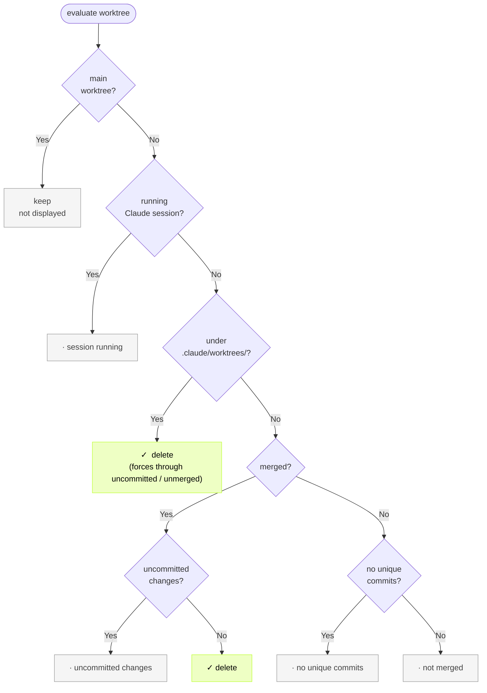
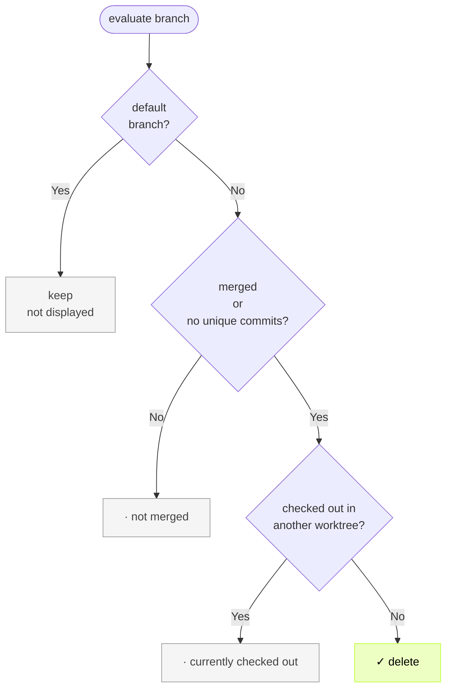

# git-harvest

English | [日本語](./README.ja.md)

<br>
<div align="center">
  
</div>
<br>

Clean up branches and worktrees.


## Run directly without installing

```sh
# bun
bunx git-harvest@latest

# pnpm
pnpx git-harvest@latest

# npm
npx -y git-harvest@latest
```

### (Optional) Set up aliases

```sh
# bun
echo "alias ghv='bunx git-harvest@latest'" >> ~/.zshrc
echo "alias 'ghv!'='bunx git-harvest@latest --all'" >> ~/.zshrc

# pnpm
echo "alias ghv='pnpx git-harvest@latest'" >> ~/.zshrc
echo "alias 'ghv!'='pnpx git-harvest@latest --all'" >> ~/.zshrc

# npm
echo "alias ghv='npx -y git-harvest@latest'" >> ~/.zshrc
echo "alias 'ghv!'='npx -y git-harvest@latest --all'" >> ~/.zshrc
```

## Install

### Shell (macOS/Linux)

```sh
curl -fsSL https://raw.githubusercontent.com/nozomiishii/git-harvest/main/install.sh | bash
```

Restart your terminal or run `source ~/.zshrc` to start using git-harvest.

### Homebrew

```sh
brew install nozomiishii/tap/git-harvest
```

### (Optional) Set up aliases

Set up aliases for quicker access. You can use both or just the one you prefer:

`ghv` / `ghv!`
```sh
# Shell alias
echo "alias ghv='git-harvest'" >> ~/.zshrc
echo "alias 'ghv!'='git-harvest --all'" >> ~/.zshrc
```

`git harvest`
```sh
# Git subcommand — run as `git harvest`
git config --global alias.harvest '!git-harvest'
```


## Uninstall

```sh
curl -fsSL https://raw.githubusercontent.com/nozomiishii/git-harvest/main/uninstall.sh | bash
```

## Usage

```sh
git-harvest
```

### Options

```sh
git-harvest --help     # Show help
git-harvest --version  # Show version
git-harvest --dry-run  # Show what would be deleted without actually deleting
git-harvest --all      # Delete all branches and worktrees except the default branch
git-harvest logo       # Show the git-harvest logo
```

## Recommended workflow

By combining with Git hooks' post-merge command, you can automatically harvest after every merge or pull.

### With [lefthook](https://github.com/evilmartians/lefthook)

There are many Git hook tools such as husky, pre-commit, and simple-git-hooks, but Lefthook is recommended because it is language-agnostic and easy to integrate into monorepos. Additionally, by using lefthook-local.yaml, you can run hooks only for yourself without affecting other team members.


```yaml
# lefthook-local.yaml
post-merge:
  commands:
    git-harvest:
      run: npx -y git-harvest@latest
      # or: bunx git-harvest@latest
      # or: pnpx git-harvest@latest
```


## What it does

Status markers:

| Marker | Meaning |
|---|---|
| `✓` | Removed |
| `→` | Will be removed (dry-run) |
| `·` | Kept (followed by reason) |

### Worktree decision flow



| Order | Condition | Display | Default | `--all` |
|---|---|---|---|---|
| 1 | Running Claude session (`~/.claude/sessions/<pid>.json` matches `cwd` and `pid` is alive) | `·  session running` | Keep | Delete |
| 2 | Path is under `.claude/worktrees/` and no running session | `✓` / `→` | **Delete** (forces through uncommitted / unmerged commits) | Delete |
| 3 | Merged + uncommitted changes | `·  uncommitted changes` | Keep | Delete |
| 4 | Merged + clean | `✓` / `→` | Delete | Delete |
| 5 | No unique commits | `·  no unique commits` | Keep | Delete |
| 6 | Not merged | `·  not merged` | Keep | Delete |
| - | Main working tree | *(not shown)* | Keep | Keep |

Row 2 is **path-regime**: worktrees under `.claude/worktrees/` are treated as Claude-managed workspaces and aggressively deleted when no active session backs them (i.e. the session was archived or the local CLI exited). Worktrees outside this path fall through to rows 3+ — the original conservative logic — to avoid touching anything Claude didn't create.

**Deletion behavior under `.claude/worktrees/`**: the worktree is removed with `--force` even when it has uncommitted changes or unmerged commits. The following are preserved, however:

- **Conversation history**: stays on the Claude Code side, so `claude --resume <session-id>` can pick up where you left off.
- **Unmerged commits**: the branch ref is retained (`cleanup_branches` protects unmerged branches), so `git checkout <branch>` recovers them.

The only thing genuinely lost is **uncommitted changes**, so commit before closing a Claude session. Conversely, keeping the session open is a way to protect WIP that you can't commit yet.

### Branch decision flow



| State | Display | Default | `--all` |
|---|---|---|---|
| Merged | `✓` / `→` | Delete | Delete |
| Merged + checked out | `·  currently checked out` | Keep | Error |
| Not merged | `·  not merged` | Keep | Delete |
| No unique commits | `✓` / `→` | Delete | Delete |
| Default branch | *(not shown)* | Keep | Keep |

> `--all` exits with an error if a non-default branch is currently checked out. `--dry-run --all` shows all resources as `→` without errors.

### Claude Code integration details

git-harvest reads these paths from [Claude Code](https://claude.ai/code):

| Path | Used for |
|---|---|
| `~/.claude/sessions/<pid>.json` | Detecting a running Claude session (`cwd` matches worktree path AND `pid` is alive) |

Archiving or deleting a session from Claude Code Agent View or the claude app remote control removes the corresponding `~/.claude/sessions/<pid>.json`. git-harvest interprets the missing session file as "the user no longer needs this".

**`--all`** bypasses every guard and force-removes worktrees. Only the worktree directories are removed; session metadata is left untouched.

**Without Claude Code installed**, worktrees under `.claude/worktrees/` are still subject to the path-regime delete. If you happen to create worktrees under that path manually without using Claude, they will be deleted — but most users without Claude won't adopt that path convention, so the impact is limited.

Override paths for testing or non-standard installs:

| Env var | Default |
|---|---|
| `GIT_HARVEST_CLAUDE_SESSIONS_DIR` | `~/.claude/sessions` |

