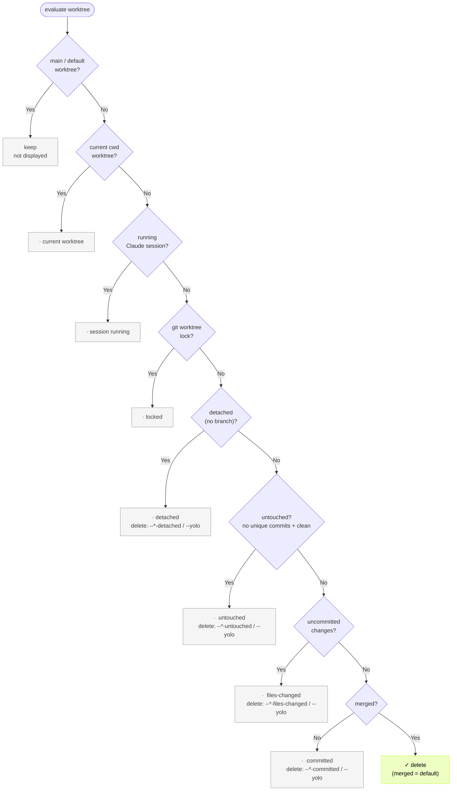
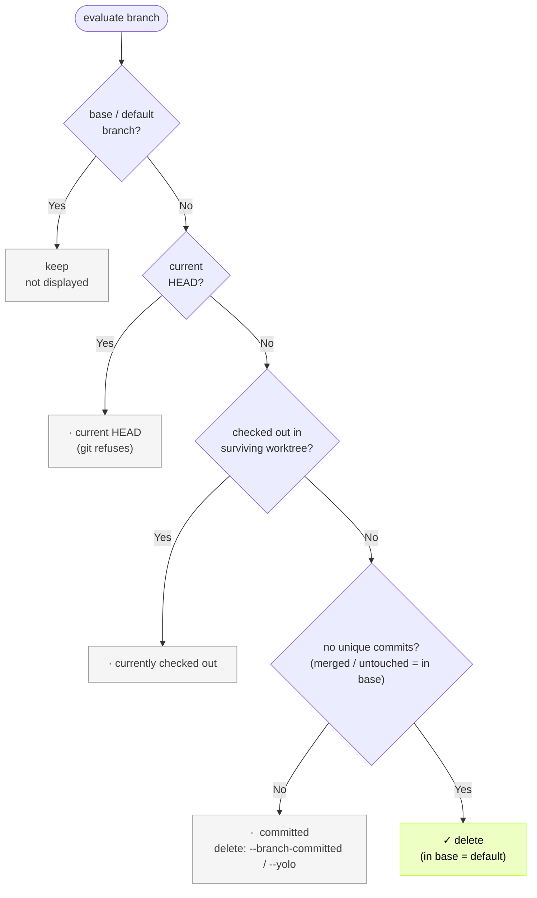

# git-harvest

English | [日本語](./README.ja.md)

<br>
<div align="center">
  
</div>

<p align="center">
  <a href="https://www.npmjs.com/package/git-harvest"></a>
</p>
<br>

Clean up branches and worktrees.


## Try it out (`--dry-run`)

See what would be deleted without deleting anything:

```sh
npx -y git-harvest@latest --dry-run
```

## Run directly without installing (Recommended)

Needs Node. Always runs the latest version — no separate update step needed.

```sh
# bun
bunx git-harvest@latest

# pnpm
pnpx git-harvest@latest

# npm
npx -y git-harvest@latest
```

### (Optional) Set up aliases

```sh
# bun
echo "alias ghv='bunx git-harvest@latest'" >> ~/.zshrc
echo "alias 'ghv!'='bunx git-harvest@latest --yolo'" >> ~/.zshrc

# pnpm
echo "alias ghv='pnpx git-harvest@latest'" >> ~/.zshrc
echo "alias 'ghv!'='pnpx git-harvest@latest --yolo'" >> ~/.zshrc

# npm
echo "alias ghv='npx -y git-harvest@latest'" >> ~/.zshrc
echo "alias 'ghv!'='npx -y git-harvest@latest --yolo'" >> ~/.zshrc
```

`git harvest`
```sh
# Git subcommand — run as `git harvest` (no install)
git config --global alias.harvest '!pnpm dlx git-harvest@latest'
# or: git config --global alias.harvest '!bunx git-harvest@latest'
# or: git config --global alias.harvest '!npx -y git-harvest@latest'
```

## Recommended workflow

By combining with Git hooks' post-merge command, you can automatically harvest after every merge or pull.

### With [lefthook](https://github.com/evilmartians/lefthook)

There are many Git hook tools such as husky, pre-commit, and simple-git-hooks, but Lefthook is recommended because it is language-agnostic and easy to integrate into monorepos. Additionally, by using lefthook-local.yaml, you can run hooks only for yourself without affecting other team members.


```yaml
# lefthook-local.yaml
post-merge:
  commands:
    git-harvest:
      run: npx -y git-harvest@latest
      # or: bunx git-harvest@latest
      # or: pnpx git-harvest@latest
```

## Usage

```sh
git-harvest
```

Bare `git-harvest` is the safe default: it deletes only merged worktrees and branches. Riskier stages need an explicit flag.

### Options

```sh
git-harvest --help     # Show help
git-harvest --version  # Show version
git-harvest --dry-run  # Show what would be deleted without deleting (alias: -n)
git-harvest logo       # Show the git-harvest logo
```

Each scope (normal worktree, `.claude/worktrees/` worktree, branch) carries its own deletion threshold. A flag lowers that threshold to a riskier stage and deletes everything from there toward `merged`. One flag sets one scope; combining flags or `--yolo` lets the riskiest side win.

Worktree threshold (normal path):

```sh
git-harvest --worktree-files-changed   # Delete from files-changed (everything, uncommitted included)
git-harvest --worktree-committed       # Delete from committed (committed and merged)
```

Worktree threshold (`.claude/worktrees/` path):

```sh
git-harvest --claude-worktree-files-changed   # Delete from files-changed (everything)
git-harvest --claude-worktree-committed       # Delete from committed
```

Branch threshold (branches have no files-changed stage):

```sh
git-harvest --branch-committed   # Delete from committed (everything)
```

Off-ladder worktrees, kept by default:

```sh
git-harvest --worktree-detached          # Delete detached normal-path worktrees
git-harvest --claude-worktree-detached   # Delete detached .claude/worktrees/ worktrees
git-harvest --worktree-untouched         # Delete untouched normal-path worktrees
git-harvest --claude-worktree-untouched  # Delete untouched .claude/worktrees/ worktrees
```

A detached worktree's commits are unreachable from any branch, so removing it can lose them permanently with no reflog recovery. `--help` flags this caution on `--worktree-detached` / `--claude-worktree-detached` / `--yolo`.

The nuke — preview it first with `git-harvest --dry-run`:

```sh
git-harvest --yolo   # Delete everything except invariants, uncommitted included
```

`--yolo` removes every worktree and branch — normal path and `.claude/worktrees/` path, uncommitted changes and detached commits included — leaving only the invariants below. It removes them without any confirmation prompt — the name is the only warning.

`--all` is gone; use `--yolo`. Note the behavior changed: the old `--all` forced through `git worktree lock` with `-f -f`, while `--yolo` keeps locked worktrees (run `git worktree unlock` first to remove one).

### Invariants

These are always protected and cannot be overridden by any flag or `--yolo`:

- main / default-branch worktree
- current cwd worktree
- locked worktree (`git worktree lock`)
- worktree with a running Claude session
- current HEAD branch
- branch checked out in a surviving worktree


## What it does

A worktree or branch moves through commit lifecycle stages:

```
untouched
  ↓
files-changed  →  committed  →  merged
  ↑
  └─ editing sends it back to files-changed (from any stage)
```

Each resource is classified by its most at-risk (earliest) stage; uncommitted changes win over the branch's commit state. `merged` is the safe default because merged work is fully recoverable. `untouched` (no unique commits, identical to base) and `detached` (a worktree with no branch) sit off this ladder — kept by default, removed only by their own flag or `--yolo`.

### Deletion thresholds

A flag lowers a scope's threshold to a riskier stage and deletes that stage and everything safer (`·` kept, `✓` deleted):

| Stage | If deleted | (default) | `--*-committed` | `--*-files-changed` |
|---|---|---|---|---|
| files-changed | lost for good | · | · | ✓ |
| committed | reflog recovery (fiddly) | · | ✓ | ✓ |
| merged | fully recoverable | ✓ | ✓ | ✓ |

`--*` is `--worktree-*` for normal-path worktrees and `--claude-worktree-*` for worktrees under `.claude/worktrees/`.

### Presets

The default deletes only `merged`; `--yolo` is the bundle of every flag below.

| Scope | Stage | Flag | default | `--yolo` |
|---|---|---|---|---|
| normal worktree | files-changed | `--worktree-files-changed` | · | ✓ |
| normal worktree | committed | `--worktree-committed` | · | ✓ |
| normal worktree | merged | *(default)* | ✓ | ✓ |
| normal worktree | detached | `--worktree-detached` | · | ✓ |
| normal worktree | untouched | `--worktree-untouched` | · | ✓ |
| claude worktree | files-changed | `--claude-worktree-files-changed` | · | ✓ |
| claude worktree | committed | `--claude-worktree-committed` | · | ✓ |
| claude worktree | merged | *(default)* | ✓ | ✓ |
| claude worktree | detached | `--claude-worktree-detached` | · | ✓ |
| claude worktree | untouched | `--claude-worktree-untouched` | · | ✓ |
| branch | committed | `--branch-committed` | · | ✓ |
| branch | merged | *(default)* | ✓ | ✓ |

Status markers:

| Marker | Meaning |
|---|---|
| `✓` | Removed |
| `→` | Will be removed (dry-run) |
| `·` | Kept (followed by reason) |

Each kept node below notes which flag removes it. Invariants cannot be moved by any flag.

### Worktree decision flow



`--*` is `--worktree-*` for normal-path worktrees and `--claude-worktree-*` for worktrees under `.claude/worktrees/`. The default behavior is identical for both paths (delete merged only); only which flag applies differs.

| Order | State | Display | Removed by |
|---|---|---|---|
| 1 | main / default-branch worktree | *(not shown)* | invariant (never) |
| 2 | current cwd worktree | `·  current worktree` | invariant (never) |
| 3 | running Claude session (`~/.claude/sessions/<pid>.json` matches `cwd` and `pid` is alive) | `·  session running` | invariant (never) |
| 4 | locked (`git worktree lock`) | `·  locked` | invariant (never) |
| 5 | detached (no branch) | `·  detached` | `--*-detached` / `--yolo` |
| 6 | untouched (no unique commits + clean) | `·  untouched` | `--*-untouched` / `--yolo` |
| 7 | files-changed (uncommitted changes) | `·  files-changed` | `--*-files-changed` / `--yolo` |
| 8 | committed (unique commits, not yet merged) | `·  committed` | `--*-committed` / `--*-files-changed` / `--yolo` |
| 9 | merged | `✓` / `→` | default |

A detached worktree's commits are not reachable from any branch, so removing it deletes its per-worktree reflog and the commits can be lost permanently. Committed worktrees keep their branch ref, so `git checkout <branch>` recovers the commits; only uncommitted changes are genuinely lost when a files-changed worktree is removed.

#### About the "Disconnected" indicator on iPhone

A Remote Control session shown as **"Disconnected"** on iPhone / the claude app is **not a paused-and-resumable state**. It means the session has fully ended — the [official docs](https://code.claude.com/docs/en/remote-control#limitations) make this explicit:

> **Local process must keep running**: Remote Control runs as a local process. If you close the terminal, quit VS Code, or otherwise stop the `claude` process, the session ends.
>
> **Extended network outage**: if your machine is awake but unable to reach the network for more than roughly 10 minutes, the session times out and the process exits.

So a Disconnected session means **the local process has already exited and the session is over**. What remains on iPhone is server-side bookkeeping — messages sent there don't reach anything.

git-harvest mirrors this reality by only checking for an **active local process** (a matching entry in `~/.claude/sessions/<pid>.json` with a live `pid`). It does not distinguish Connected / Disconnected / Archived on the iPhone side. A Disconnected worktree has no live process, so it loses the session invariant and is judged by its stage like any other worktree.

The conversation history (`~/.claude/projects/<encoded-cwd>/<session-id>.jsonl`) is kept separately, so `claude --resume <session-id>` can start a new session from where you left off. The worktree dir itself needs to be recreated separately (via `git worktree add` or `EnterWorktree`).

### Branch decision flow

Branches have no working tree, so there is no files-changed or detached state. `untouched` (no unique commits) is the same ref as base, so it folds into `merged` and is deleted by default. A branch is therefore either `committed` or `merged` (in base, untouched included).



| Order | State | Display | Removed by |
|---|---|---|---|
| 1 | base / default branch | *(not shown)* | invariant (never) |
| 2 | current HEAD | `·  current HEAD` | invariant (never) |
| 3 | checked out in a surviving worktree | `·  currently checked out` | invariant until the worktree is removed |
| 4 | committed (unique commits, not in base) | `·  committed` | `--branch-committed` / `--yolo` |
| 5 | merged / untouched (in base) | `✓` / `→` | default |

The surviving worktree set is what remains after worktree cleanup. A branch whose worktree was removed in the same run becomes free and is then judged here. So an untouched branch checked out in a worktree is deleted once that worktree goes (`--worktree-untouched` / `--yolo`).

### Claude Code integration details

git-harvest reads these paths from [Claude Code](https://claude.ai/code):

| Path | Used for |
|---|---|
| `~/.claude/sessions/<pid>.json` | Detecting a running Claude session (`cwd` matches worktree path AND `pid` is alive) |

Archiving or deleting a session from Claude Code Agent View or the claude app remote control removes the corresponding `~/.claude/sessions/<pid>.json`. A worktree with a running session is an invariant and is never removed; once the session file is gone, the worktree is judged by its stage like any other.

A worktree under `.claude/worktrees/` is treated as a separate scope: the default still deletes only merged worktrees, but its threshold is lowered by the `--claude-worktree-*` flags rather than the `--worktree-*` flags. `--yolo` removes worktree directories only; session metadata is left untouched. Conversation history (`~/.claude/projects/<encoded-cwd>/<session-id>.jsonl`) stays separately, so `claude --resume <session-id>` can start a new session where you left off (recreate the worktree dir via `git worktree add` or `EnterWorktree`).

Override paths for testing or non-standard installs:

| Env var | Default |
|---|---|
| `GIT_HARVEST_CLAUDE_SESSIONS_DIR` | `~/.claude/sessions` |

