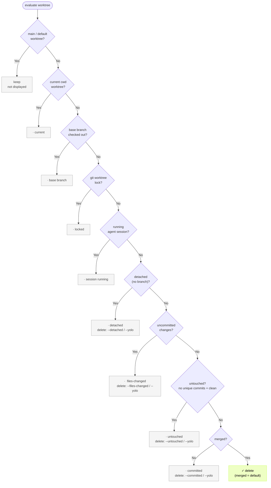

# git-harvest

English | [日本語](./README.ja.md)

<p>
  <a href="https://www.npmjs.com/package/git-harvest"></a>
</p>

Branch and worktree cleanup tool.

## Try it

Preview the cleanup:

```sh
npx -y git-harvest@latest --dry-run
```

```
Worktrees
  ·  ~/.claude/worktrees/foo   untouched   identical to base, no work
  →  ~/.claude/worktrees/done

Branches
  ·  feature/wip               committed   below the threshold, kept
  →  feature/done
```

## Setup (optional)

`npx -y git-harvest@latest` works on its own, but an alias makes it shorter. It always runs the latest version — nothing to update.

Git alias — call it as `git harvest`:

```sh
git config --global alias.harvest '!npx -y git-harvest@latest'
# or: git config --global alias.harvest '!pnpx git-harvest@latest'
# or: git config --global alias.harvest '!bunx git-harvest@latest'
```

Shell alias — add to `.bashrc` / `.zshrc`:

```sh
alias ghv='npx -y git-harvest@latest'
```

## Usage

```sh
# Remove merged branches (the safe default -- works in a post-merge hook too)
git harvest

# Also remove untouched worktrees (checked out but no work done)
git harvest --untouched

# Also remove worktrees with uncommitted file changes
git harvest --files-changed

# Also remove worktrees/branches with committed work
git harvest --committed
```

Flags combine freely. `git harvest --committed --untouched` removes committed branches plus untouched worktrees.

Or delete everything:

```sh
# Equivalent to --files-changed --committed --untouched --detached
git harvest --yolo
```

`--committed` accepts an optional scope (`=worktree`, `=claude-worktree`, `=codex-worktree`, `=branch`). `--files-changed` accepts worktree scopes only (`=worktree`, `=claude-worktree`, `=codex-worktree`). See [Scopes](#scopes-narrowing-the-target) for details.

## Automate (optional)

Add `git harvest` to a post-merge hook and it runs on every merge or pull.

### With [lefthook](https://github.com/evilmartians/lefthook)

Lefthook is language-agnostic and easy to drop into a monorepo. With `lefthook-local.yaml` you can run it only for yourself without affecting teammates.

```yaml
# lefthook-local.yaml
post-merge:
  commands:
    git-harvest:
      run: npx -y git-harvest@latest
      # or: pnpx git-harvest@latest
      # or: bunx git-harvest@latest
```

## How it works

A branch goes through these states:

```
untouched
  ↓
files-changed  →  committed  →  merged
  ↑
  └─ editing brings it back to files-changed (from any state)
```

Deletion targets for each flag (✓ = deleted):

| stage | risk when deleted | no flag | `--committed` | `--files-changed` |
| --- | --- | --- | --- | --- |
| files-changed | unrecoverable | · | · | ✓ |
| committed | reflog recovery (tedious) | · | ✓ | ✓ |
| merged | fully safe | ✓ | ✓ | ✓ |

The default deletes `merged` only — the most conservative choice, safe even in a post-merge hook.

### Scopes (narrowing the target)

| scope | target |
|---|---|
| `worktree` | worktrees on a normal path |
| `claude-worktree` | worktrees under `.claude/worktrees/` |
| `codex-worktree` | worktrees under `$CODEX_HOME/worktrees` (usually `~/.codex/worktrees`) |
| `branch` | branches |

Thresholds are kept per scope. `--committed` affects every scope; `--committed=claude-worktree` affects only that scope. Combine with commas (`--committed=worktree,branch`) or by repeating the flag.

### Off-ladder (protected by default)

| state | definition | default | delete |
|---|---|---|---|
| `untouched` | clean and no unique commits (identical to base) | kept | `--untouched` |
| `detached` | a worktree with no branch (detached HEAD) | kept | `--detached` |

An untouched branch is just a ref identical to base, so it is deleted by default. Worktrees signal intent and are kept; branches are just leftover — an intentional asymmetry.

> WARNING: a detached worktree's commits have no branch ref, and removing the worktree deletes its reflog with it — they can be lost permanently (no reflog recovery).

### Status markers

| marker | meaning |
|---|---|
| `✓` | deleted |
| `→` | would delete (dry-run) |
| `·` | kept (reason on the right) |
| `✗` | failed to delete |

```
Worktrees
  ·  ~/.claude/worktrees/foo        untouched      identical to base, no work
  ·  ~/repo-hotfix                  detached       no branch
  ·  ~/.claude/worktrees/bar        committed      below the threshold (merged), kept
  ✓  ~/.claude/worktrees/done

Branches
  ·  feature/wip                    committed      below the threshold, kept
  ✓  feature/done
```

### Invariants (always protected)

- the main / default worktree
- the worktree on the base branch (`base branch`)
- the worktree of the current working directory (`current`)
- a locked worktree (`git worktree lock`)
- a worktree with a running agent session (`session running`)
- the current HEAD branch (`current HEAD`)
- a branch checked out in a surviving worktree (`checked out`)

### Worktree decision flow

Decision tree at the default threshold (merged). Each keep node shows which flag would override it; invariants cannot be overridden.



Branches follow the same idea — current HEAD → checked out → classification — and by default only branches already in base (in-base) are deleted.

### Claude Code worktrees

git-harvest detects running [Claude Code](https://claude.ai/code) sessions and protects their worktrees.

| path | purpose |
|---|---|
| `~/.claude/sessions/<pid>.json` | detect a running session (match the worktree by `cwd` + confirm the process with `kill -0 pid`) |

Worktrees under `.claude/worktrees/` belong to the `claude-worktree` scope and follow the same stage thresholds as normal worktrees (always protected while a session is running). Use a scope, e.g. `--committed=claude-worktree`, to target claude worktrees only.

A session is considered running when a matching local process is alive (`~/.claude/sessions/<pid>.json` exists and `kill -0 pid` succeeds). Remote Control's iPhone status (Connected / Disconnected / Archived) is not distinguished. The conversation history (`~/.claude/projects/<encoded-cwd>/<session-id>.jsonl`) survives even when the worktree is removed, so `claude --resume <session-id>` resumes where you left off.

### Codex app worktrees

Codex creates app-managed worktrees under `$CODEX_HOME/worktrees` (usually `~/.codex/worktrees`). Those worktrees are treated as the `codex-worktree` scope and judged by the same stage thresholds as normal worktrees. Use a scope, e.g. `--committed=codex-worktree`, to target Codex worktrees only.

When the Codex thread database (`$CODEX_HOME/state_*.sqlite`) has an active (non-archived) user thread whose cwd falls inside a worktree, git-harvest keeps that worktree as `session running`. When the database is missing or unreadable, the check is skipped and normal stage classification applies.
